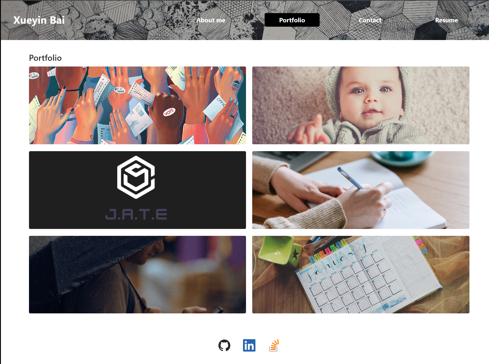

# my-react-portfolio

## Description

This is a portfolio of my work samples. It is a single-page applications build on [React](https://www.npmjs.com/package/react).

## Table of Contents

- [Usage](#usage)
- [Technologies](#technologies)
- [Installation](#installation)
- [License](#license)
- [Questions](#questions)

## Usage

This application is deployed at: https://xybai0103.github.io/my-react-portfolio/

- WHEN you load the portfolio
- THEN you are presented with a page containing a header, a section for content, and a footer
- WHEN you view the header
- THEN you are presented with the my name and navigation with titles corresponding to different sections of the portfolio
- WHEN you view the navigation titles
- THEN you are presented with the titles About Me, Portfolio, Contact, and Resume, and the title corresponding to the current section is  
  highlighted
- WHEN you click on a navigation title
- THEN you are presented with the corresponding section below the navigation without the page reloading and that title is highlighted
- WHEN you load the portfolio the first time
- THEN the About Me title and section are selected by default
- WHEN you are presented with the About Me section
- THEN you see my avatar and a short bio about me
- WHEN you are presented with the Portfolio section
- THEN you see titled images of six of my applications with links to both the deployed applications and the corresponding GitHub repositories
- WHEN you are presented with the Contact section
- THEN you see a contact form with fields for a name, an email address, and a message
- WHEN you move your cursor out of one of the form fields without entering text
- THEN you receive a notification that this field is required
- WHEN you enter text into the email address field
- THEN you receive a notification if you have entered an invalid email address
- WHEN you are presented with the Resume section
- THEN you see a link to a downloadable resume and a list of my proficiencies
- WHEN you view the footer
- THEN you are presented with icon links to my profiles on GitHub, LinkedIn, and Stack Overflow.

## Technologies

- [React](https://www.npmjs.com/package/react)
- [bootstrap](https://www.npmjs.com/package/bootstrap)

## Installation

N/A

## License

N/A

## Questions

If you have additional questions, feel free to reach me through github or email.

Github: https://github.com/xybai0103

Email: xueyin0103@gmail.com
